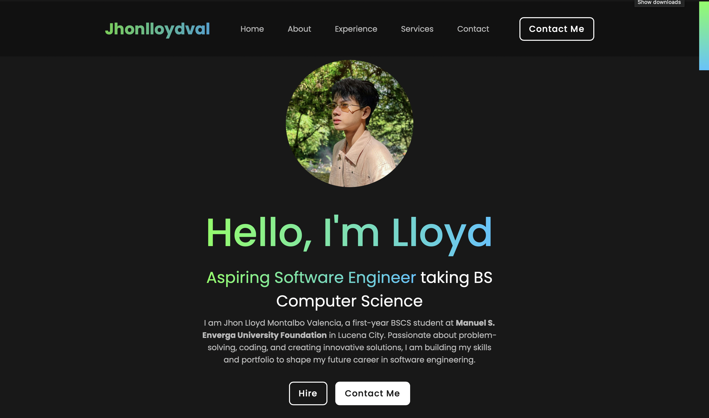

# ImJhonlloydval.github.io

# PORTFOLIO WEBSITE  

This is a personal portfolio website created to showcase my skills, projects, and experience as a first-year Computer Science student aspiring to be a Software Engineer. The format of the website is inspired by HowToWebDev; however, I made the website entirely myself using HTML, CSS, and a bit of JavaScript. I also integrated a website link in the Services section made from third-party web development software.  

The website includes details about my background, achievements and education, services (Blog, Projects, and Photography), and personal information.  

## TABLE OF CONTENTS  
1. **Features**  
2. **Technologies Used**  
3. **Setup Instructions**  
4. **Website Structure**  
5. **Preview**  

## FEATURES  
- **Responsive Design:** Adapts seamlessly to different screen sizes, especially on mobile and computers.  
- **Formal and Modern UI:** Includes smooth navigation through different sections with a visually appealing layout. Has gradient options and hover styles.  
- **Social Links:** Direct links to my social media platforms when the icons are clicked (Facebook, Instagram, LinkedIn, GitHub).  
- **Services Section:** Where my blog, coding projects, and photography are located.  
- BLOG: https://psgweb.my.canva.site/jhonlloydvalblog
- PROJECTS: https://psgweb.my.canva.site/jhonlloydvalprojects
- PHOTOGRAPHY: https://psgweb.my.canva.site/jhonlloydvalphotography
- **Other Website:** There is a link embedded in the "Visit Blog," "View Projects," and "See Photography" buttons. Clicking on it will navigate you to a corresponding website made from third-party software.  
- **Contact Form:** Allows visitors to send messages directly. Currently turned off since I am still not accepting messages.  
- **Footer Section:** Contains location, contact details, and an "About" description.  

## TECHNOLOGIES USED  
- **HTML5:** For the structure and content of the website.  
- **CSS3:** For styling and responsive design.  
- **JavaScript:** For interactive features and menu toggle.  
- **Boxicons:** For adding modern icons.  
- **Google Fonts:** For custom typography (Poppins).  

## SETUP INSTRUCTIONS  
- You may navigate through my GitHub where the link to the website is located (https://jhonlloydval.github.io/ImJhonlloydval.github.io/).  
- You can also download or clone the repository itself, then open the project folder locally and double-click the `index.html` file to open it in a browser.  

## WEBSITE STRUCTURE  
- **Home:** Introduction, photo, navigation pane, and social links.  
- **About:** Personal background and programming language skills.  
- **Experience:** Details about education, online courses, and achievements.  
- **Services:** Blog, Projects, and Photography links.  
- **Contact:** Form and contact details.  
- **Footer:** About services, social links, and location.  

## PREVIEW
**Home Page**

**Blog Section Home Page**

**Project Section Home Page**

**Photography Section Home Page**

